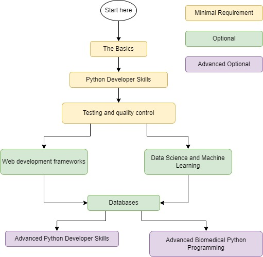

# Zifo Python Training and Guidelines

## Introduction

Welcome to the Zifo Python training documentation and guidelines for programmers!  

The internet is abundant with resources for learning the Python programming langauge, but it can often be overwhelming to understand where to start and what direciton to take given your career and objectives.

In this repository you will find a roadmap for building different Python programming expertise. For each topic we will direct you to a free resource that has been verified by our Python programming team as well as optional paid resources that provide benefits like certifications.

For each resource you will find the following icons to help you decide which resource is best for you:

:gift_heart: Free resource \
:moneybag: Paid resource \
:closed_book: Book/Article/Documentation \
:movie_camera: Video \
:computer: Interactive 

We will try to limit the resources to those that we feel are most appropriate and delivers to best return on investment. When we provide more than one resource recommendation, it is because they are different formats that may suit different learning styles. You do not need to complete all the resources, just pick the one that you feel is best for you.

You will find that some resources overlap with each other and therefore the completion of one may contribute to knowledge acquired for multiple stages of your Python training.

Separate to the training material, you will find a guide on how you should setup Python on your local machine and manage projects for Zifo related work. See `Python_Setup.md` document for details. If you are unfamiliar with concepts such as git, github, and the command line interface, we recommend completing some of the tutorials in the [1.2 Must-know developer skills](#12-must-know-developer-skills) section first.

---
## Table of Contents
1. [Roadmap](#roadmap)
2. [The Basics](#1-the-basics)
3. [Python Developer Skills](#2-python-developer-skills)
4. [Testing and quality control](#3-testing-and-quality-control)
5. [Web development frameworks](#4-web-development-frameworks)
6. [Databases](#5-databases)
7. [Data Science and Machine Learning](#6-data-science-and-machine-learning)
8. [Advanced Python Developer Skills](#7-advanced-python-developer-skills)
9. [Advanced Biomedical Python Programming](#8-advanced-biomedical-python-programming)

---

## Roadmap

The roadmap below gives a high level overview of the stages recommended in our training guidelines.

Within each stage of the Python training roadmap there are options as to what technologies to learn. We recommend that you focus on one option to begin with and return to additional material at the end of the roadmap.

---

## 1 The Basics

The resources in this section are recommended as a minimal requirement for anyone that will be using Python. 

[1.1 Basic Syntax](#11-basic-syntax) \
[1.2 Must-know developer skills](#12-must-know-developer-skills)

### 1.1 Basic Syntax

The python ecosystem can sometimes confuse newcomers because of the existance of multiple versions of the language. The most recent version of Python is 3.11.0, but some older projects still use Python 2.7. Python 2.7 is no longer supported and will not be covered in this guide.

Although there are many different versions of Python 3, the syntax has not changed significantly between versions, but many of the libraries have. For this reason, we recommend that you use Python 3.9 or greater for all of your projects.

When learning the basic syntax however, do not be too concerned over the version of Python you are using. The syntax is very similar between versions and you can always upgrade your version later.

:gift_heart: :movie_camera: [Freecodecamp - Python for Beginners](https://www.freecodecamp.org/news/python-programming-course/)

:computer: [Freecodecamp - Python for Everybody](https://www.freecodecamp.org/learn/scientific-computing-with-python/); only the _Python for Everybody_ section is required for basic syntax, however, this section also contains a lot of other useful material that covers more advanced topics.

### 1.2 Must-know developer skills

These are the skills that you should have independent of Python programming knowledge that are important to use Python professionally. If you are unfamiliar with any of these concepts, we recommend that you complete the tutorials before you start learning any advanced concepts.

[1.2.1 Git and version control](#121-git-and-version-control) \
[1.2.2 Basic command line knowledge](#122-basic-command-line-knowledge) \
[1.2.3 Using IDEs](#123-using-ides) \
[1.2.4 Basic SQL](#124-basic-sql)

#### 1.2.1 Git and version control

:gift_heart: :movie_camera: [Introduction to Git and GitHub](https://youtu.be/RGOj5yH7evk)

:gift_heart: :movie_camera: [Introduction to Git and GitHub](https://youtu.be/Uszj_k0DGsg )

#### 1.2.2 Basic command line knowledge

:gift_heart: :closed_book: [How to Use the Command Line Interface – for Beginners](https://www.freecodecamp.org/news/how-to-use-the-cli-beginner-guide/); recommended reading for all beginners

:gift_heart: :closed_book: [Learn enough command line to be dangerous](https://www.learnenough.com/command-line-tutorial)

:gift_heart: :movie_camera: [Terminal commands you must know](https://www.youtube.com/watch?v=CV-ven_rxhw)

#### 1.2.3 Using IDEs

For most developers we recommend either Visual Studio Code (VSCode) or PyCharm. Whereas VSCode is free, PyCharm has a limited community edition but requires a paid license for the professional version.

:gift_heart: :movie_camera: [Setting up a Python Development with VSCode](https://www.youtube.com/watch?v=-nh9rCzPJ20)

:gift_heart: :closed_book: [Python development with VSCode](https://realpython.com/python-development-visual-studio-code/)

#### 1.2.4 Basic SQL

SQL or "Structured Query Language" is a language used to interact with relational databases. Although you will not need to know SQL to use Python, it is a useful skill to have and will be required for some of the more advanced topics in this guide.

:gift_heart: :movie_camera: [SQL Basics for beginners](https://www.youtube.com/watch?v=zbMHLJ0dY4w)

:gift_heart: :computer: [Learn SQL: SQL Tutorial for Beginners](https://www.programiz.com/sql)

#### 1.2.5 Python package managers and virtual environments

Python has two main package managers, pip and conda. Pip is the default package manager for Python and is used to install packages from the Python Package Index (PyPI). Conda is a package manager that is used to install packages from the Anaconda repository. Conda is also used to manage virtual environments and install packages from other repositories such as Bioconda.

A virtual environment is a tool that helps to keep dependencies required by different projects separate by creating isolated Python environments for them. This is useful because it allows you to work on multiple projects with different dependencies at the same time without having to worry about breaking your other projects.

There are also more advanced package managers such as poetry, pipenv and hatch, which provide additional functionality and environment management. See the `Python_Setup.md` file in this repository for more information on how you should manage your python environments.

If you are new to Python, we recommend that as a mimimum you familarise yourself with venv and conda.

:gift_heart: :closed_book: [A beginners guide to pip](https://realpython.com/lessons/what-is-pip-overview/); beginners should start here

:gift_heart: :closed_book: [Using Python's pip to Manage Your Projects' Dependencies](https://realpython.com/what-is-pip/); a more advanced overview of pip

:gift_heart: :closed_book: [Effective python environment management](https://realpython.com/effective-python-environment/); highly recommended reading to understand different approaches to managing your python environments

## 2 Python Developer Skills

If you have got this far, well done! You have now completed the basics and are ready to start learning some of the more advanced concepts in Python. The resources in this section are recommended for anyone that will be using Python professionally.

[2.1 Data structures and Algorithms](#21-data-structures-and-algorithms) \
[2.2 Object-oriented programming](#22-object-oriented-programming) \
[2.3 Comprehensions, Iterators, and Generators](#23-comprehensions-iterators-and-generators) \
[2.4 Map, Reduce, and Lambda functions](#24-map-reduce-and-lambda-functions) \
[2.5 Regular Expressions](#25-regular-expressions) \
[2.6 Caching](#26-caching) \
[2.7 Multi-processing and multi-threading](#27-multi-processing-and-multi-threading) \
[2.8 Other advanced syntax and concepts](#28-other-advanced-syntax-and-concepts)

### 2.1 Data structures and Algorithms

Data structures and algorithms are the building blocks of computer science. They are the fundamental concepts that are used to solve problems in the real world. In this section, we will cover some of the most common concepts that are applicable not just to Python but all software development.

:gift_heart: :closed_book: [Data structures in Python](https://realpython.com/python-data-structures/)

:moneybag: :closed_book: [Grokking Algorithms:  
An illustrated guide for programmers and other curious people](https://www.manning.com/books/grokking-algorithms)

:gift_heart: :movie_camera: [Data Structures and Algorithms in Python - Full Course for Beginners](https://www.youtube.com/watch?v=pkYVOmU3MgA)

### 2.2 Object-oriented programming

Python is an object-oriented programming language. This means that it supports object-oriented programming (OOP) concepts such as classes, inheritance, and encapsulation. In this section, we will link to resources that cover some of the most common OOP concepts that are applicable not just to Python but all software development.

:gift_heart: :movie_camera: [Object Oriented Programming with Python - Full Course for Beginners](https://www.youtube.com/watch?v=Ej_02ICOIgs)

:gift_heart: :closed_book: [Object-oriented programming in Python](https://realpython.com/python3-object-oriented-programming/)

:moneybag: :computer: :movie_camera: [Object-oriented Programming in Python: Create Your Own Adventure Game](https://www.futurelearn.com/courses/object-oriented-principles)

### 2.3 Comprehensions, Itertools, and Generators

Although Python is an object-oriented programming language, it also supports functional programming concepts such as comprehensions (If you're wondering what we mean by object-oriented programming and functional programming, and the differences between them, checkout this [article](https://www.geeksforgeeks.org/difference-between-functional-programming-and-object-oriented-programming/)). In this section, we will link to resources that cover these concepts.

:gift_heart: :closed_book: [Comprehensions in Python](https://realpython.com/list-comprehension-python/)

:gift_heart: :movie_camera: [Python Tutorial: Comprehensions - How they work and why you should be using them](https://www.youtube.com/watch?v=3dt4OGnU5sM)

:gift_heart: :closed_book: [Itertools in Python](https://realpython.com/python-itertools/)

:gift_heart: :closed_book: [Generators in Python](https://realpython.com/introduction-to-python-generators/)

:gift_heart: :movie_camera: [Intermediate Python Programming Course](https://www.youtube.com/watch?v=HGOBQPFzWKo); this video covers multiple intermediate python concepts that are applicable to many topics in this section

:gift_heart: :movie_camera: [Python Generators Explained](https://www.youtube.com/watch?v=u3T7hmLthUU)

### 2.4 Map, Reduce, and Lambda functions

Map, Reduce, and Lambda functions are functional components in Python that are used to perform operations on lists. In this section, we will link to resources that cover these concepts.

:gift_heart: :movie_camera: [Lambda in Python - Advanced Python 08 - Programming Tutorial - Map Filter Reduce](https://www.youtube.com/watch?v=D2TJ9wvSP94)

:gift_heart: :movie_camera: [Intermediate Python Programming Course](https://www.youtube.com/watch?v=HGOBQPFzWKo); this video covers multiple intermediate python concepts that are applicable to many topics in this section

:gift_heart: :closed_book: [Lambda functions](https://book.pythontips.com/en/latest/lambdas.html)

:gift_heart: :closed_book: [Map, Filter, and Reduce in Python](https://book.pythontips.com/en/latest/map_filter.html)

### 2.5 Regular Expressions

Regular expressions or "regex" are a powerful tool that can be used to search for patterns in text. In Python, regular expressions are implemented in the `re` module. 

:gift_heart: :movie_camera: [Intermediate Python Programming Course](https://www.youtube.com/watch?v=HGOBQPFzWKo); this video covers multiple intermediate python concepts that are applicable to many topics in this section

:gift_heart: :movie_camera: [Regular Expressions in Python](https://www.youtube.com/watch?v=nxjwB8up2gI)

:gift_heart: :closed_book: [Regular Expressions: Regexes in Python](https://realpython.com/regex-python/)

### 2.6 Caching

Caching is a technique that is used to improve the performance of applications.

:gift_heart: :movie_camera: [The single most useful decorator in Python](https://www.youtube.com/watch?v=DnKxKFXB4NQ)

:gift_heart: :closed_book: [Caching in Python using the LRU Cache strategy](https://realpython.com/lru-cache-python)

### 2.7 Multi-processing and multi-threading

:gift_heart: :movie_camera: [Intermediate Python Programming Course](https://www.youtube.com/watch?v=HGOBQPFzWKo); this video covers multiple intermediate python concepts that are applicable to many topics in this section

:gift_heart: :closed_book: [Multi-processing in Python](https://realpython.com/python-concurrency/)

:gift_heart: :movie_camera: [Next-Level Concurrent Programming In Python With Asyncio](https://www.youtube.com/watch?v=GpqAQxH1Afc)

### 2.8 Other advanced syntax and concepts

Here we provide resources for other advanced Python concepts that are not covered in the previous sections but are enormously useful for Python developers.

:gift_heart: :movie_camera: [Dunder/Magic Methods](https://www.youtube.com/watch?v=z11P9sojHuM)

:gift_heart: :movie_camera: [Decorators](https://www.youtube.com/watch?v=tfCz563ebsU)

:gift_heart: :movie_camera: [Encapsulation](https://www.youtube.com/watch?v=FDdfGFhY9Ms)

:gift_heart: :movie_camera: [Python dataclasses will save you HOURS](https://www.youtube.com/watch?v=vBH6GRJ1REM)

:gift_heart: :movie_camera: [Collections](https://www.youtube.com/watch?v=QswQA1lRIQY)

## 3 Testing and quality control
 
When you write production ready Python code, you should always write tests for your code. This is because tests are a great way to ensure that your code is working as expected. In this section, we will link to resources that cover some of the most common testing and quality control concepts.

There are a few different tools that can be used to write tests in Python and to quality check your code. We recommend using PyTest and a few specific tools for quality assurance, and will link to resources that cover these tools.

### 3.1 PyTest

:gift_heart: :closed_book: [Effective Python Testing With Pytest](https://realpython.com/pytest-python-testing/)

:gift_heart: :movie_camera: [PyTest Tutorial | Unit Testing Framework In Python](https://www.youtube.com/watch?v=byaxg00Gf9I)

### 3.2 Linting, formatting, and Pre-commit

:gift_heart: :closed_book: [Linting and Formatting in Python](https://realpython.com/python-code-quality/); recommended reading for all

:gift_heart: :movie_camera: [Keeping your repo tidy with Pre-commit](https://www.youtube.com/watch?v=psjz6rwzMdk); recommended video for all

### 3.3 Documentation

Writing documentation for your code is a great way to ensure that your code is easy to understand and use. All Python developers at Zifo are required to write docstrings and documentation for their code. 

:gift_heart: :movie_camera: [Python Docstrings | Python Best Practices](https://www.youtube.com/watch?v=0YUdYk5E-w4); recommended video for all

:gift_heart: :movie_camera: [Top 5 Ways To Document Your Code](https://www.youtube.com/watch?v=uPMxUnBjGG8); recommended video for all

### 3.4 Logging

:gift_heart: :movie_camera: [Intermediate Python Programming Course](https://www.youtube.com/watch?v=HGOBQPFzWKo); this video covers multiple intermediate python concepts that are applicable to many topics in this section

:gift_heart: :movie_camera: [Logging in Python || Learn Python Programming](https://www.youtube.com/watch?v=g8nQ90Hk328)

:gift_heart: :closed_book: [Logging in Python](https://realpython.com/python-logging/)

### 3.5 Type hints

## 4 Web development frameworks

Congratulations, you have completed the core Python sections and mandatory content! It is no

### 4.1 Flask

### 4.2 Django

### 4.3 FastAPI

### 4.4 Tornado

### 4.5 Testing with Selenium

## 5 Databases

### 5.1 SQLite

### 5.2 Relational databases with SQLAlchemy

### 5.3 Document databases wtih PyMongo and Mongoengine
 
### 5.4 Graph databases with Neo4j

## 6 Data Science and Machine Learning

https://github.com/siboehm/awesome-learn-datascience#readme

### 6.1 JupyterLab

### 6.2 Numpy and Pandas

### 6.3 Data visualisation with Matplotlib and Seaborn

### 6.4 Interactive plotting and Dashboards with Plotly and Dash

### 6.5 Streamlit

### 6.6 Scientific programming with SciPy

### 6.7 Statistical modelling with Statmodels 

### 6.8 Machine learning with Scikit-Learn

https://scikit-posthocs.readthedocs.io/en/latest/

### 6.9 Time-series analysis

### 6.10 Deep learning

#### 6.10.1 Fundamentals

#### 6.10.2 Tensorflow

#### 6.10.3 PyTorch

### 6.11 NLP

#### 6.11.1 Fundamentals

#### 6.11.2 NLTK

#### 6.11.3 SpaCy

#### 6.11.4 Haystack

### 6.12 Probablistic models with PyMC3 and pomegranate

### 6.13 Model explanation and interpretation

## 7 Advanced Python Developer Skills

### 7.1 Package development and distribution

### 7.2 Design patterns

### 7.3 Cython and C bindings

### 7.4 Interacting with AWS and Azure

### 7.5 Distributed computing with PySpark

## 8 Advanced Biomedical Python Programming

### 8.1 Survival analysis with lifelines

### 8.2 BioPython

### 8.3 Nextflow

### 8.4 Single cell analysis with ScanPy

### 8.5 Cytometry data analysis with CytoPy

### 8.6 Discrete event simulation with SimPy

https://github.com/vinta/awesome-python
https://github.com/danielecook/Awesome-Bioinformatics
